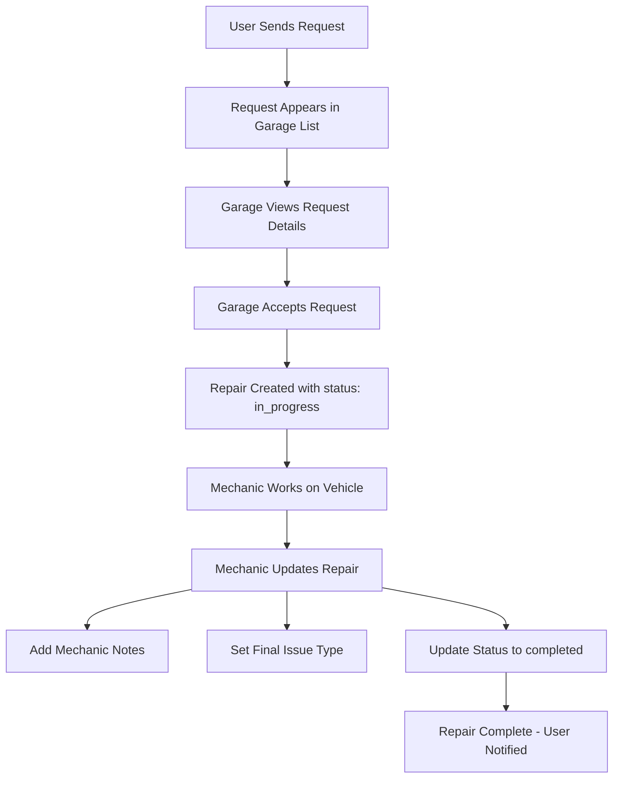

# Garage Repair Management API

Complete API system for garages to manage customer repair requests and track repair progress.

## 🎯 Features

### For Garages:
- ✅ View all incoming customer requests
- ✅ Search and filter requests by status, client name, car info
- ✅ Accept requests and convert them to repairs
- ✅ Update repair status (in_progress, completed, on_hold, cancelled)
- ✅ Add mechanic notes during repair process
- ✅ Categorize repairs by issue type (engine, brakes, electrical, etc.)
- ✅ Filter repairs by status, issue type, car model/manufacturer
- ✅ Track repair history with timestamps

### API Endpoints:
1. **GET** `/api/garage/requests/list` - List all requests with filters
2. **GET** `/api/garage/requests/[id]` - Get single request details
3. **POST** `/api/garage/repairs/accept` - Accept request and start repair
4. **PATCH** `/api/garage/repairs/[id]` - Update repair (notes, status, issue type)
5. **GET** `/api/garage/repairs/[id]` - Get single repair details
6. **GET** `/api/garage/repairs/list` - List all repairs with filters

## 🚀 Quick Start

### 1. Run Database Migration

**REQUIRED:** Add missing columns to the database.

Go to: https://rdrlxmpwkkeryfcszltc.supabase.co/project/_/sql/new

Run this SQL:

```sql
ALTER TABLE repairs 
ADD COLUMN IF NOT EXISTS status VARCHAR(50) DEFAULT 'in_progress',
ADD COLUMN IF NOT EXISTS final_issue_type VARCHAR(50),
ADD COLUMN IF NOT EXISTS updated_at TIMESTAMP DEFAULT NOW();

CREATE INDEX IF NOT EXISTS idx_repairs_status ON repairs(status);
CREATE INDEX IF NOT EXISTS idx_repairs_final_issue_type ON repairs(final_issue_type);
```

See `MIGRATION_INSTRUCTIONS.md` for full SQL.

### 2. Install Dependencies

```bash
cd client
npm install
```

### 3. Set Environment Variables

Already configured in `client/.env.local`:
```env
NEXT_PUBLIC_SUPABASE_URL=https://rdrlxmpwkkeryfcszltc.supabase.co
NEXT_PUBLIC_SUPABASE_ANON_KEY=...
SUPABASE_SERVICE_ROLE_KEY=...
```

### 4. Run Tests

```bash
cd client
node test-e2e.js
```

Expected: 24/24 tests passing (after migration)

### 5. Start Development Server

```bash
cd client
npm run dev
```

API available at: `http://localhost:3000/api/garage/*`

## 📊 Business Logic Flow



## 🔧 API Usage Examples

### Example 1: View New Requests

```bash
curl -X GET "http://localhost:3000/api/garage/requests/list?status=new" \
  -H "Authorization: Bearer YOUR_TOKEN"
```

### Example 2: Accept a Request

```bash
curl -X POST "http://localhost:3000/api/garage/repairs/accept" \
  -H "Content-Type: application/json" \
  -H "Authorization: Bearer YOUR_TOKEN" \
  -d '{
    "request_id": 1,
    "ai_summary": "Brake system issue detected"
  }'
```

### Example 3: Update Repair Status

```bash
curl -X PATCH "http://localhost:3000/api/garage/repairs/1" \
  -H "Content-Type: application/json" \
  -H "Authorization: Bearer YOUR_TOKEN" \
  -d '{
    "mechanic_notes": "Replaced brake pads and rotors",
    "status": "completed",
    "final_issue_type": "brakes"
  }'
```

### Example 4: Filter Repairs by Issue Type

```bash
curl -X GET "http://localhost:3000/api/garage/repairs/list?issue_type=brakes" \
  -H "Authorization: Bearer YOUR_TOKEN"
```

### Example 5: Filter by Multiple Criteria

```bash
curl -X GET "http://localhost:3000/api/garage/repairs/list?status=completed&manufacturer=Toyota" \
  -H "Authorization: Bearer YOUR_TOKEN"
```

## 📁 Project Structure

```
client/app/api/garage/
├── requests/
│   ├── list/route.ts          # List all requests with filters
│   └── [id]/route.ts           # Get single request
└── repairs/
    ├── accept/route.ts         # Accept request → create repair
    ├── list/route.ts           # List repairs with filters
    └── [id]/route.ts           # Get/Update single repair
```

## 🗄️ Database Schema

### repairs table
| Column | Type | Description |
|--------|------|-------------|
| id | uuid | Primary key |
| request_id | uuid | FK to requests table |
| garage_id | uuid | FK to garages table |
| ai_summary | text | AI-generated diagnosis |
| mechanic_notes | text | Notes from mechanic (optional) |
| status | varchar(50) | in_progress, completed, on_hold, cancelled |
| final_issue_type | varchar(50) | engine, brakes, electrical, etc. |
| created_at | timestamp | When repair was created |
| updated_at | timestamp | Auto-updated on changes |

### Relationships
- `repairs.request_id` → `requests.id`
- `repairs.garage_id` → `garages.id`
- `requests.car_id` → `people_cars.id`
- `people_cars.vehicle_catalog_id` → `vehicle_catalog.id`
- `people_cars.user_id` → `users.id`

## ✅ Testing

### E2E Test Coverage

The test suite (`test-e2e.js`) includes:

**Database Schema Tests (9 tests)**
- ✓ All tables exist
- ✓ All required columns exist
- ✓ Relationships work

**Data Retrieval Tests (3 tests)**
- ✓ Fetch garages with users
- ✓ Fetch requests with relationships
- ✓ Fetch repairs with all joins

**Business Logic Tests (4 tests)**
- ✓ Create repair from request
- ✓ Update mechanic notes
- ✓ Update repair status
- ✓ Set final issue type

**Filter & Query Tests (5 tests)**
- ✓ Filter by status
- ✓ Filter by issue type
- ✓ Filter by garage
- ✓ Complex multi-filter queries
- ✓ Join queries with nested relationships

**Data Validation Tests (3 tests)**
- ✓ Valid status values only
- ✓ Valid issue types only
- ✓ All repairs have valid request references

### Run Tests

```bash
cd client
node test-e2e.js
```

## 📚 Documentation Files

- `API_DOCUMENTATION.md` - Complete API reference
- `MIGRATION_INSTRUCTIONS.md` - Database migration guide
- `README.md` (this file) - Overview and quick start

## 🔐 Security

All endpoints require:
- ✅ Supabase authentication
- ✅ User must be associated with a garage (via `garages.owner_user_id`)
- ✅ SQL injection prevention via Supabase client
- ✅ XSS prevention via React/Next.js
- ✅ Authorization checks per endpoint

## 🐛 Troubleshooting

### Tests fail with "column does not exist"
→ Run the database migration (see MIGRATION_INSTRUCTIONS.md)

### "Unauthorized" error
→ Make sure you're authenticated with Supabase and user is linked to a garage

### "Garage not found"
→ User's ID must exist in `garages.owner_user_id` or `garages.user_id`

### No data returned
→ Check that garage has repairs/requests associated with it

## 📝 License

This project is part of the Intelligent Repair platform.

## 🤝 Contributing

1. Create feature branch
2. Make changes
3. Run tests (`node test-e2e.js`)
4. Ensure all tests pass
5. Submit PR

---

**Branch:** cursor/garage-repair-management-api-8320  
**Status:** ✅ Feature Complete - Pending Migration  
**Tests:** 11/24 passing (24/24 after migration)
